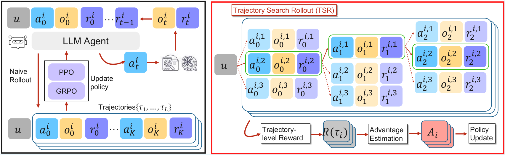

<div align="center">

# TSR: Trajectory-Search Rollouts for Multi-Turn RL of LLM Agents

[](https://arxiv.org/abs/2602.11767)
[](https://iclr.cc/virtual/2026/10012516)

</div>

<div style="margin-bottom: 1em;">
  <strong>Abstract</strong><br>
  Advances in large language models (LLMs) are driving a shift toward using reinforcement learning (RL) to train agents from iterative, multi-turn interactions across tasks. However, multi-turn RL remains challenging as rewards are often sparse or delayed, and environments can be stochastic. In this regime, naive trajectory sampling can hinder exploitation and induce mode collapse. We propose TSR (Trajectory-Search Rollouts), a training-time approach that repurposes test-time scaling ideas for improved per-turn rollout generation. TSR performs lightweight tree-style search to construct higher-quality trajectories by selecting promising actions and trajectory prefixes during rollout generation. This improves rollout quality while preserving stable policy optimization and remains compatible with standard policy-gradient optimizers by design. Across Sokoban, FrozenLake, and WebShop, TSR achieves success-rate gains of up to 15 percentage points and converges in fewer optimization steps, while trading additional training-time rollout compute for stronger policies that require no search at inference time. By moving search from test time to the rollout stage of training, TSR provides a modular mechanism for stronger multi-turn agent learning, complementary to existing frameworks and rejection-sampling-style selection methods.
</div>

<br>

<p align="center">
  
  <br>
  <em>Method Comparison: (Left) Multi-turn RL with naive rollouts: trajectories are sampled independently without any search. (Right) Trajectory Search Rollouts (TSR): using tree-style search to construct high-quality trajectories by selecting high-scoring actions at each turn.</em>
</p>

---

## 🔎 TSR_RAGEN

Research code for **Trajectory-Search Rollouts (TSR)** in multi-turn language-model agents. TSR builds on [RAGEN: Understanding Self-Evolution in LLM Agents via Multi-Turn Reinforcement Learning](https://ragen-ai.github.io/v1/) and supports Sokoban, FrozenLake, and WebShop.

## 🌿 TSR implementations

Each TSR method lives on a dedicated branch so its implementation and configuration are easy to inspect:

| Method | Branch | Job script |
| --- | --- | --- |
| TSR best-of-N | `tsr-best-of-n` | `scripts/train_tsr_best_of_n.sh` |
| TSR beam search | `tsr-beam-search` | `scripts/train_tsr_beam_search.sh` |
| TSR lookahead | `tsr-lookahead` | `scripts/train_tsr_lookahead.sh` |

The `main` branch contains the shared RAGEN baseline. Switch to the desired TSR branch before running a TSR job.

## 📁 Repository layout

```text
config/      training and evaluation configurations
ragen/       environments, rollout management, and trainers
scripts/     setup, training, and evaluation entry points
train.py     training entry point
```

## 🚀 Setup

The training stack is intended for Linux with NVIDIA GPUs and CUDA.

```bash
git clone --recurse-submodules https://github.com/aladinD/TSR_RAGEN.git
cd TSR_RAGEN

python -m venv .venv
source .venv/bin/activate
bash scripts/setup.sh
```

For WebShop, install its additional dependencies:

```bash
bash scripts/setup.sh webshop
```

## 🧪 Run TSR jobs

The TSR scripts take an environment name followed by optional Hydra overrides:

```bash
git switch tsr-best-of-n
bash scripts/train_tsr_best_of_n.sh sokoban

git switch tsr-beam-search
bash scripts/train_tsr_beam_search.sh frozen_lake

git switch tsr-lookahead
bash scripts/train_tsr_lookahead.sh frozen_lake
```

Supported environment names are `sokoban`, `frozen_lake`, and `webshop` when a corresponding configuration is present on the selected branch.

## 🧱 Run baseline jobs

Each job accepts additional Hydra overrides after the script name.

```bash
bash scripts/train_sokoban.sh
bash scripts/train_frozen_lake.sh
bash scripts/train_webshop.sh
```

For example, to use four GPUs and change the model:

```bash
bash scripts/train_sokoban.sh \
  system.CUDA_VISIBLE_DEVICES=0,1,2,3 \
  trainer.n_gpus_per_node=4 \
  model_path=Qwen/Qwen2.5-3B-Instruct
```

Outputs and checkpoints are written below `results/` by default. Weights & Biases logging is disabled in the supplied configs; enable it with `trainer.logger=[console,wandb]` if desired.

## 📊 Evaluate a model

Pass a Hugging Face model identifier or a local checkpoint path:

```bash
bash scripts/evaluate.sh sokoban model_path=/path/to/model
bash scripts/evaluate.sh frozen_lake model_path=/path/to/model
bash scripts/evaluate.sh webshop model_path=/path/to/model
```

Evaluation rollouts are saved under `results/eval/`.

## 📚 Citation

If you find TSR useful in your research, please cite:

```bibtex
@misc{djuhera2026tsrtrajectorysearchrolloutsmultiturn,
  title={TSR: Trajectory-Search Rollouts for Multi-Turn RL of LLM Agents},
  author={Aladin Djuhera and Swanand Kadhe and Farhan Ahmed and Syed Zawad and Heiko Ludwig and Holger Boche},
  year={2026},
  eprint={2602.11767},
  archivePrefix={arXiv},
  primaryClass={cs.AI},
  url={https://arxiv.org/abs/2602.11767},
}
```
